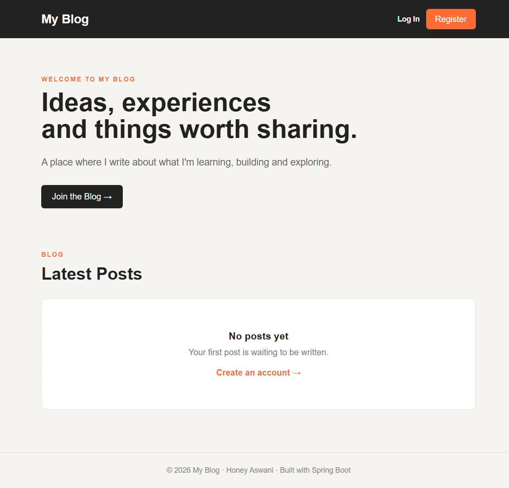
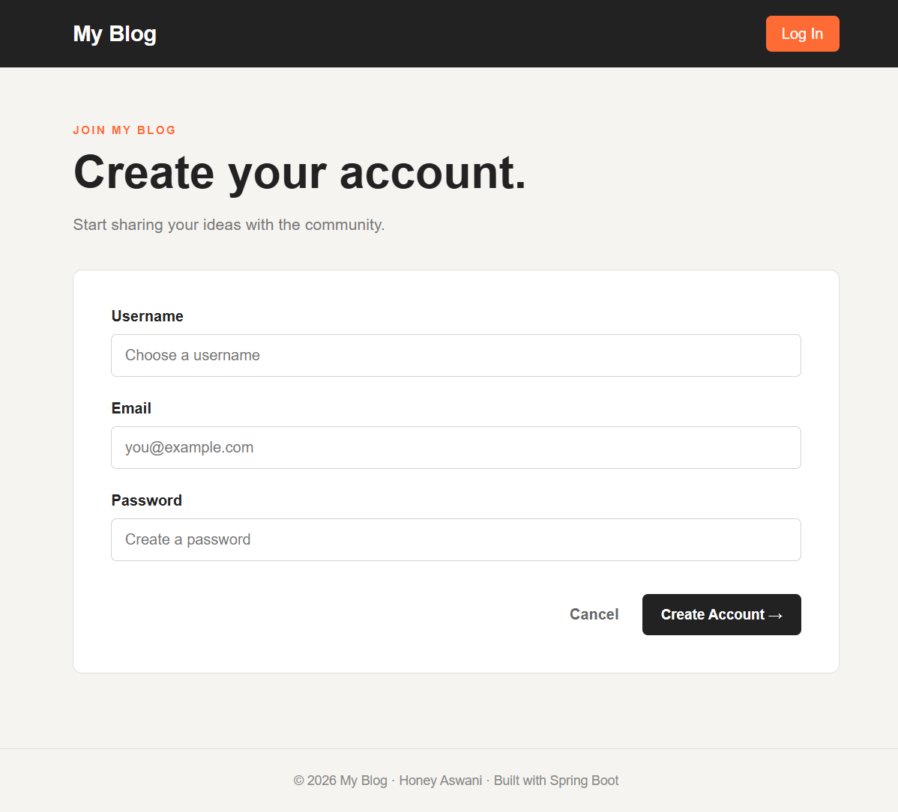
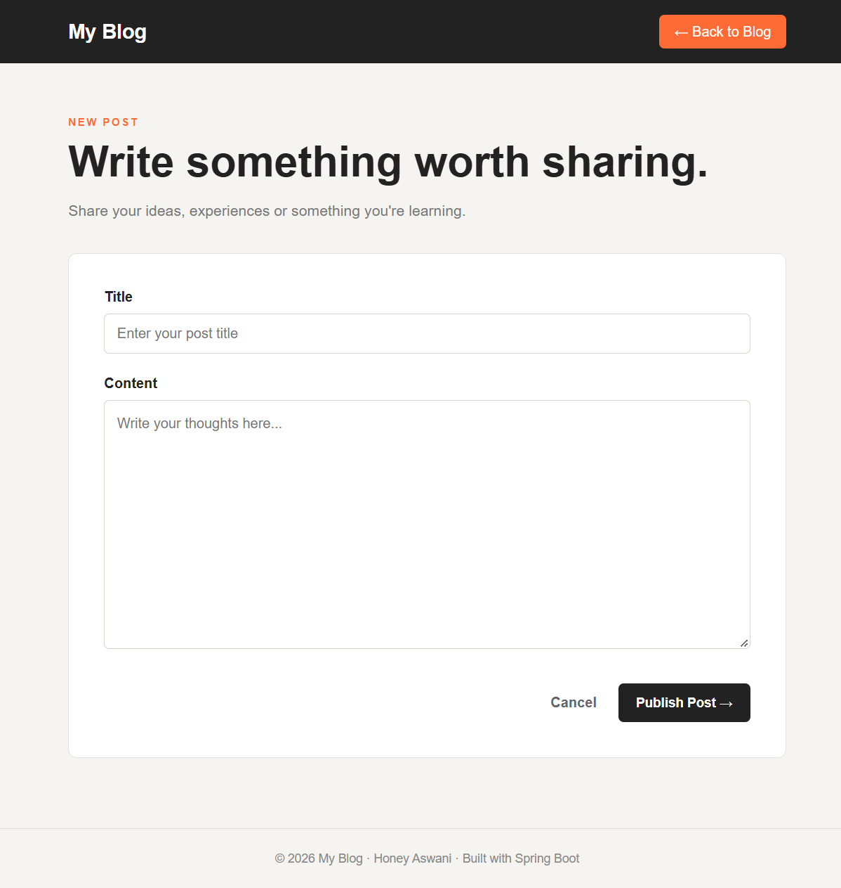
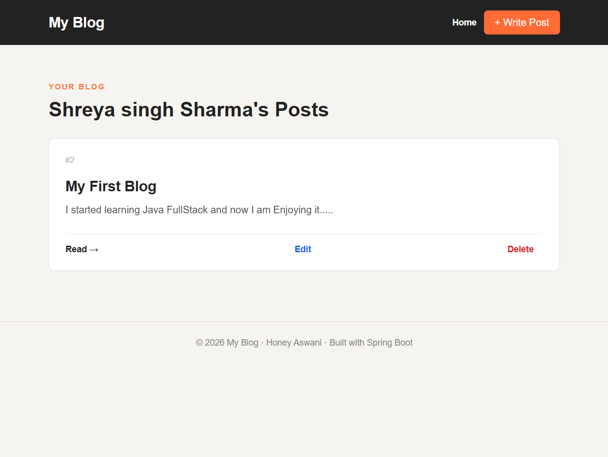

# BlogNest 📝

BlogNest is a full-stack blogging web application built using Java, Spring Boot, Thymeleaf, Spring Security, and MySQL.

It allows users to create, read, update, and delete blog posts with secure authentication and owner-based authorization.

## 🌐 Live Demo

https://blognest-production-ffed.up.railway.app

## 💻 GitHub Repository

https://github.com/honeyAswani/BlogNest

## ✨ Features

- User registration and login
- Secure password encryption using BCrypt
- Spring Security authentication
- Create blog posts
- View blog posts
- Edit your own posts
- Delete your own posts
- My Posts section
- Owner-based authorization
- Form validation
- Responsive design
- MySQL database integration
- Cloud deployment using Railway

## 🛠️ Tech Stack

### Backend
- Java
- Spring Boot
- Spring MVC
- Spring Security
- Spring Data JPA
- Hibernate

### Frontend
- HTML
- CSS
- Thymeleaf

### Database
- MySQL

### Tools & Deployment
- Maven
- Git
- GitHub
- Railway

## 📸 Screenshots

### Home Page



### Login / Register



### Create Post



### My Posts



## 🏗️ Project Architecture

BlogNest follows a layered architecture:

```text
                    Browser
                       ↓
                  Controller
                       ↓
                    Service
                       ↓
                  Repository
                       ↓
                    MySQL
